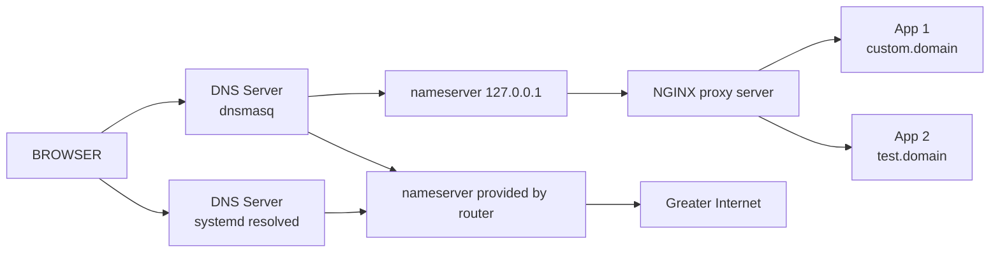

# Custom Domain Names and subdomains for development

## Intro

Developing a [Ruby on Rails](https://rubyonrails.org/) application with subdomains is much more difficult than you would imagine.
Although we could just install [puma-dev](https://github.com/puma/puma-dev) following the installation guide, we wouldn't  understand why that works, or how, and so we close our minds to whats down that rabbit hole.

## Down the Rabbit Hole

To implement any solution it certainly helps to know what is going on behind the scenes and so what we have to understand is that there is a local DNS service on our machines that is searching in the cache for any site ip addresses which we are trying to look for in our browser. This is all well and good but it doesn't consider our local ports or in our case port 80 with a custom domain name so what we need is a **configurable** local DNS service that we can use to map 127.0.0.1 which is localhost by default to a custom domain able to handle subdomains.
To do this we use [dnsmasq](https://dnsmasq.org/), however dnsmasq on its own will just return whatever is running on port 80 so we need a way to map our server which in my case was running on port 3000 to port 80 so for that we use [NGINX](https://docs.nginx.com/) as a proxy server/reverse proxy.



## setting up NGINX

installing NGINX on linux is pretty simple as it should be provided by default by the package manager of your distro, if not you may have to jump through some hoops to get it installed but for this blog that is outside the scope
So... assuming nginx wasn't to difficult to install we shall continue.
The next step is to configure nginx so that our application is served at `http://localhost/` instead of `http://localhost:3000/`, the difference being that by default a url withot the port specified, is directed to port 80 if it is using the HTTP protocol and port 443 if it is using the HTTPS protocol.
To do that we to configure NGINX to pass/proxy our traffic from port 80 to port 3000.
This is achived in the following configuration which will be somewhere in the /etc/nginx/ directory (location may vary):
```txt
http {
    .
    .
    .
    server {
        listen       80;
        server_name custom.domain *.custom.domain;

        location / {
            proxy_pass http://localhost:3000;
            proxy_redirect off;
            proxy_set_header Host $host;
        }
        .
        .
        .
    }
    .
    .
    .
}
```
**N.B** there will be other configurations in the both the server and http blocks which don't need to be removed or changed

The important code being `listen 80;` and `proxy_pass http://localhost:3000`

now if everything has gone according to plan we should see our website at `http://localhost/` if we exclude the line with `server_name` in our configuration.

to add a custom domain name we need to add dnsmasq and the line including `server_name` to our NGINX config so first install and configure dnsmasq.

## dnsmasq

Install dnsmasq from the default package manager or follow the recommended installation for your distro from the docs.
dnsmasq generates a massive default config file with explanatory comments for every option however it is easier to just append to the file as you may want to change something else in future.
For our purposes we are going to add the following to our config file:
```txt
port=53
domain-needed
bogus-priv
address=/custom.domain/127.0.0.1
address=/.custom.domain/127.0.0.1
listen-address=127.0.0.1
bind-interfaces
```

`port=53` runs dnsmasq as the default local DNS
`domain-needed` and `bogus-priv` prevent packets with malformed domain names and packets with private IP addresses from leaving your network, don't ask me what this means because I am not entirely sure, more info can be found [here](https://www.linux.com/topic/networking/advanced-dnsmasq-tips-and-tricks/).
the `address` lines add custom.domain to the server redirecting them to 127.0.0.1 which is where our service is running as mentioned earlier on port 80 which is default lookup
the .custom.domain allows for subdomains to also be resolved
`listen-address` is self explanatory and is then listening on localhost
`bind-interfaces` binds all interfaces and updates if some interfaces get dropped or changed.

## Setting dnsmasq as default

by default on systemd systems the default DNS resolver is systemd-resolved so to enable dnsmasq which listens on the same port we have to first disable systemd-resolved by running:
```bash
sudo systemctl stop systemd-resolved
sudo systemctl disable systemd-resolved
```

This should destroy some symlinked files so that the service won't run on start up.
we then need to enable dnsmasq by running:

```bash
sudo systemctl enable dnsmasq
sudo systemctl start dnsmasq
```

All this has done at this stage is enable dnsmasq as the default DNS server and allowed it to redirect custom.domain to port 80 which should allow us to use subdomains and use the custom address but if we would like to add multiple custom domains we need to restrict the proxy server to only proxy custom.domain, to do that we add the following line to our nginx config under the listen command:
```txt
server_name custom.domain *.custom.domain;
```

## Adding 127.0.0.1 to /etc/resolv.conf

Because we are using dnsmasq as our default DNS server we need it to resolve both local requests and internet wide and so it is using the /etc/resolv.conf file to look up the DNS server of the router or internet connection we are using, so to add ourselves to the list of available nameservers we have to append `nameserver 127.0.0.1` to our `/etc/resolv.conf` file, by doing this we have allowed our DNS server to first consider our local entries. 
I have this set up in an alias in my .zshrc file:
```bash
alias nameserver:add="sudo sed -i '1s/^/# Custom Entry\nnameserver 127.0.0.1\n/' /etc/resolv.conf"
```

## Putting it all together 

Everything is in place and near ready to go so to get it all running together we may need to restart our services and visit the page:
```bash
sudo systemctl restart nginx
sudo sed -i '1s/^/# Custom Entry\nnameserver 127.0.0.1\n/' /etc/resolv.conf
# the above command can be replaced by nameserver:add if you have sourced your shell file
sudo systemctl restart dnsmasq
```

## Adding more domains

To add an additional domain add an address to the dnsmasq config file:
```txt
address=/new.domain/127.0.0.1
```

And add a server to the NGINX config file:

```txt
http {
    .
    .
    .
    server {
        listen       80;
        server_name custom.domain *.custom.domain;

        location / {
            proxy_pass http://localhost:3000;
            proxy_redirect off;
            proxy_set_header Host $host;
        }
        .
        .
        .
    }

    server {
        listen       80;
        server_name new.domain;

        location / {
            proxy_pass http://localhost:4000;
            proxy_redirect off;
            proxy_set_header Host $host;
        }
        .
        .
        .
    }
    .
    .
    .
}
```

## Conclusion

If you have any problems the official docs are the ultimate source of truth
This solution may not work for everyone but it works very well for me

### Update

I have since moved away from using /etc/resolv.conf and have updated dnsmasq.conf to use a custom resolver file:

```txt
# /etc/dnsmasq.conf

port=53
domain-needed
bogus-priv
address=/custom.domain/127.0.0.1
address=/.custom.domain/127.0.0.1
listen-address=127.0.0.1
bind-interfaces
resolv-file=/etc/dnsmasq-resolv.conf
```
```txt
# /etc/dnsmasq-resolv.conf

# localhost
nameserver 127.0.0.1
# Google DNS
nameserver 8.8.8.8
nameserver 8.8.4.4
# Cloudflare DNS
nameserver 1.1.1.1
nameserver 1.0.0.1
```

by doing this i don't need to alias auto writing to resolv.conf, and hopefully these DNS servers are fast enough, but in case they are not, the last line of dnsmasq.conf can be undone and you can use your local resolv.conf file

You also have to turn off the NetworkManager DNS service by editing /etc/NetworkManager/NetworkManager.conf

```toml
# /etc/NetworkManager/NetworkManager.conf

[main]
dns=none
```

I updated to this latest version because my dns service was slow and impacted my work, i hope someone else can benefit from this